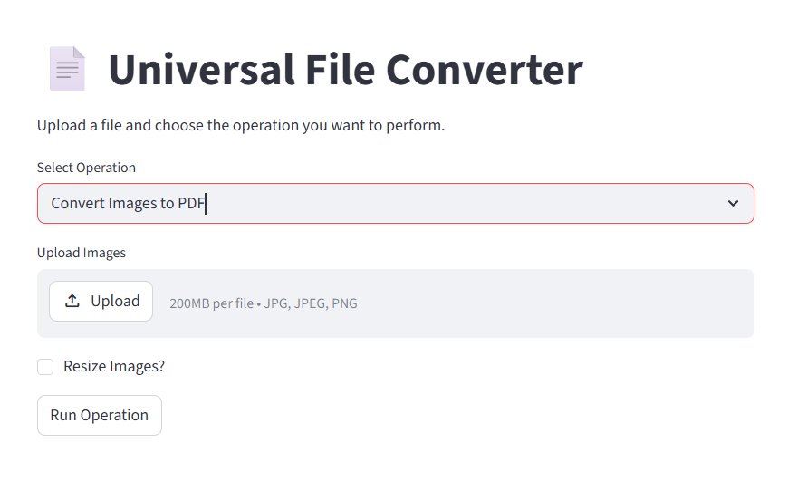
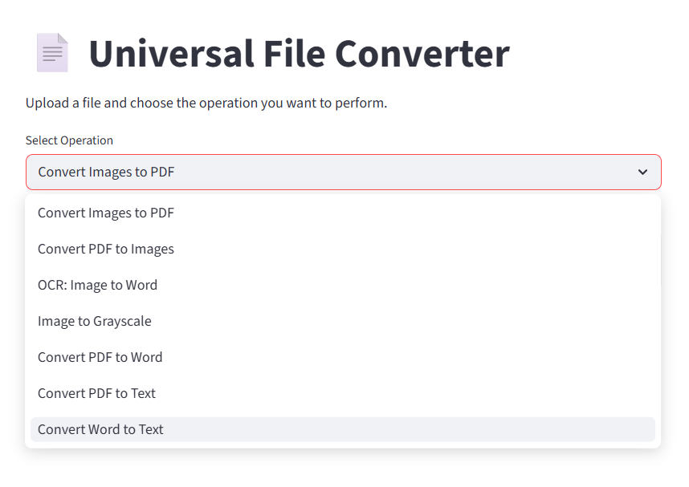
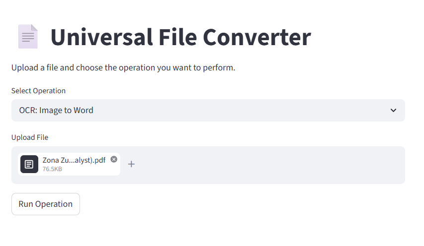
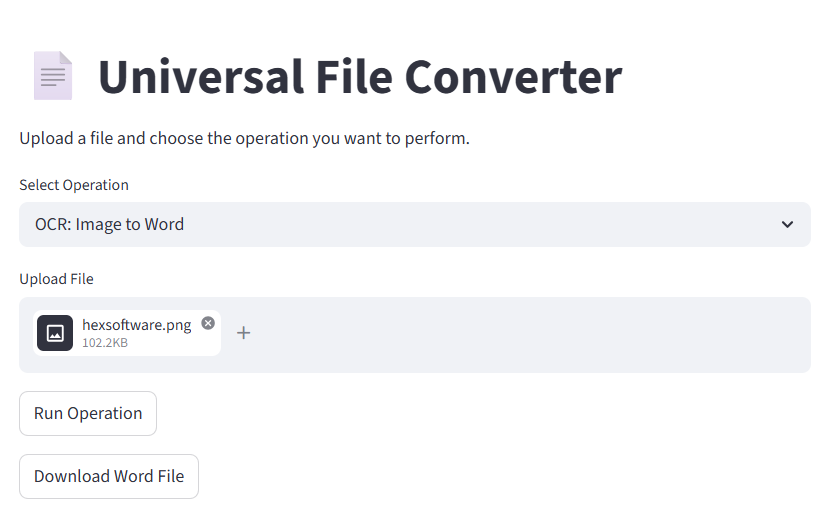

# Universal File Converter
A **Streamlit-based application** that enables seamless conversion between Word, PDF, TXT, and image formats with **OCR support**.  
It provides **batch automation, progress tracking**, and **secure file handling** for efficient document processing.
---
## 🌐 Live Demo
[Universal File Converter on Streamlit](https://universalfile-xa8nvfxqcwosveqsh8dfjs.streamlit.app/)
---
## ⚡ Features
- Convert files between **PDF, Word, TXT, and image formats**  
- **OCR support** for image-to-text extraction using Tesseract and EasyOCR  
- **Batch processing** with progress tracking  
- **Secure file handling** with clean temporary storage
- **Image preprocessing** using OpenCV for improved OCR accuracy
---
## 🛠 Technologies Used
Python, Streamlit, pdfplumber, pdf2image, python-docx, Tesseract OCR, EasyOCR, OpenCV, Pillow
---
## 🚀 How to Run
1. Clone the repository:  
git clone (https://github.com/ZonaZubair/Universal-File-Converter.git)
---
## Install dependencies
pip install -r requirements.txt
---
## Run the app
streamlit run [app.py](http://app.py)
---
## 🖼️ UI Screenshots

<table>
  <tr>
    <td align="center">
      
       
    </td>
    <td align="center">
      
       
      <b>📂 File Upload and Conversion Options</b>
    </td>
  </tr>
  <tr>
    <td align="center">
      
       
      <b>🔍 OCR Text Extraction from Image or Scanned PDF</b>
    </td>
    <td align="center" >
      
       
      <b>⬇️ Converted File Ready for Download</b>
    </td>
  </tr>
</table>
